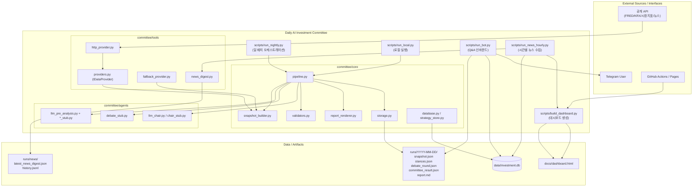
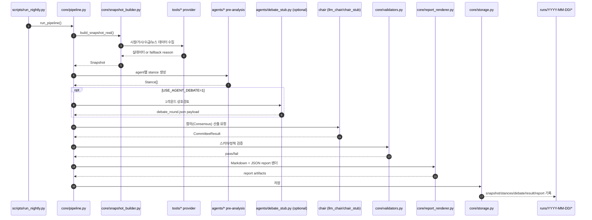

# Daily AI Investment Committee

매일 1회 시장 스냅샷을 만들고, 여러 에이전트 의견을 합쳐 최종 코멘트를 생성하는 배치 프로젝트입니다.

핵심 산출물:
- `runs/YYYY-MM-DD/` (스냅샷, 에이전트 의견, 최종 결과, 리포트)
- `runs/YYYY-MM-DD.json` (통합 JSON)
- `data/investment.db` (누적 지표/이력)
- `docs/dashboard.html` (대시보드)

## 빠른 시작

### 1) 설치
```bash
python -m pip install --upgrade pip
pip install -r requirements.txt
```

### 2) 환경 변수
프로젝트 루트의 `.env`를 사용합니다. 최소 권장:

```env
# OpenAI (LLM 사용 시)
OPENAI_API_KEY=...

# Telegram (전송/봇 사용 시)
TELEGRAM_BOT_TOKEN=...
TELEGRAM_CHAT_ID=...

# FRED (매크로 심화 지표: CPI/PMI/GDP/금리/OAS)
FRED_API_KEY=...

# 한국은행 ECOS (국내 기준금리 수집 시)
ECOS_API_KEY=...
# 선택: 수출 YoY(901Y011) 항목 코드를 직접 지정할 때
# ECOS_EXPORT_ITEM_CODE=...

# DART OpenAPI (한국 주식 재무제표, https://opendart.fss.or.kr 발급)
DART_API_KEY=...
```

API 키 발급 링크:
- FRED: https://fred.stlouisfed.org/docs/api/api_key.html
- 한국은행 ECOS: https://ecos.bok.or.kr/api
- DART: https://opendart.fss.or.kr (회원가입 → API 신청, 무료)

참고:
- `scripts/run_local.py`, `scripts/run_nightly.py`, `scripts/run_bot.py`는 `.env`를 자동 로드합니다.
- `scripts/send_morning.py`, `scripts/run_news_hourly.py`는 `.env` 자동 로드가 없습니다(실행 환경에 변수 필요).

## 커맨드 전체 정리

---

### 🔄 일일 파이프라인

| 목적 | 커맨드 |
|---|---|
| 일일 배치 실행 (AI 분석 + 보고서) | `python scripts/run_nightly.py` |
| 로컬 디버그 실행 | `python scripts/run_local.py` |
| 아침 브리프 전송 (Telegram) | `python scripts/send_morning.py` |
| 시간별 뉴스 수집 | `python scripts/run_news_hourly.py` |
| 대시보드 재생성 | `python scripts/build_dashboard.py` |
| Telegram Q&A 봇 시작 | `python scripts/run_bot.py` |

`run_nightly.py` 주요 옵션:
- `--build-dashboard` : 실행 후 대시보드 재생성
- `--no-auto-commit` / `--no-auto-push` : git 자동 푸시 비활성화

---

### 📦 매일 실행 (`sync_all.py`) — 약 5~15분

시장 지수 · 매크로 · 수급 · 워치리스트 컨센서스 · US 재무제표 · 대시보드 빌드

```bash
# 기본 (매일 권장)
python scripts/sync_all.py

# 빠른 모드 (시장/매크로/수급만, ~5분)
python scripts/sync_all.py --fast

# KR 재무제표 포함 (DART_API_KEY 필요)
python scripts/sync_all.py --with-kr-financials --year 2024

# KR 분기보고서까지
python scripts/sync_all.py --with-kr-financials --year 2024 --quarterly

# FRED 매크로 전체 재백필 (최초 1회)
python scripts/sync_all.py --backfill-macro-all
```

---

### 🗓️ 주간 실행 (`sync_weekly.py`) — 약 2~4시간

종목 마스터 갱신 · 전체 종목 컨센서스 · US 재무제표 · 대시보드 빌드  
매주 1~2회 실행 권장 (종목 데이터가 빠르게 바뀌지 않으므로 매일 불필요)

```bash
# 기본 (KR 전체 종목 컨센서스 + 마스터 갱신, 주 1회 권장)
python scripts/sync_weekly.py

# 빠른 모드: 상위 300종목만 (~30분)
python scripts/sync_weekly.py --top 300

# 중단 후 재시작
python scripts/sync_weekly.py --resume

# KR 재무제표 생략 (기본: DART_API_KEY 있으면 자동 수집)
python scripts/sync_weekly.py --skip-kr-financials

# 종목 마스터만 갱신 (빠름)
python scripts/sync_weekly.py --master-only

# FRED 매크로 전체 재백필 포함
python scripts/sync_weekly.py --deep-macro

# 종목 데이터 생략하고 마스터 + 매크로만
python scripts/sync_weekly.py --skip-stocks
```

| 플래그 | 설명 |
|---|---|
| `--top N` | 상위 N종목만 컨센서스 수집 |
| `--resume` | 오늘 수집된 종목 건너뜀 (재시작용) |
| `--skip-kr-financials` | KR 재무제표 건너뜀 (기본: DART_API_KEY 있으면 자동 수집) |
| `--skip-us-financials` | US 재무제표 건너뜀 |
| `--master-only` | 종목 마스터 갱신만 |
| `--deep-macro` | FRED 전체 재백필 |
| `--skip-stocks` | 컨센서스·재무 생략 |

---

### 📊 시장 데이터 수집 (market_daily / daily_macro / market_flow_daily)

```bash
# 시장 지수 (Kospi/Nasdaq/S&P 등) 기간 백필
python scripts/backfill_market_daily_history.py --start-date 2024-01-01 --end-date 2026-04-26

# 매크로 지표 기본 (US10Y/VIX/DXY/원달러/WTI) 백필
python scripts/backfill_daily_macro_history.py --start-date 2024-01-01 --end-date 2026-04-26

# 매크로 심화 지표 (FRED: CPI/PMI/GDP/금리/OAS) 백필
python scripts/backfill_macro_indicators.py

# 수급 (외국인/기관/개인) 백필
python scripts/backfill_market_flow_history.py --start-date 2024-01-01 --end-date 2026-04-26

# 위 전체를 날짜 범위 지정으로 한번에
python scripts/backfill_all_history.py --start-date 2024-01-01 --end-date 2026-04-26
```

---

### 🏦 종목 마스터 / 주가

```bash
# KRX 전체 상장 종목 마스터 동기화 (~2,500종목)
python scripts/sync_stock_master.py

# 특정 날짜 전체 종목 일별 주가 수집
python scripts/sync_daily_prices.py 2026-04-25
```

---

### 📈 애널리스트 컨센서스 (목표주가 / 투자의견 / EPS 추정)

```bash
# 워치리스트 수집 (KR 12 + US 10 = 22종목, 빠름)
python scripts/sync_stock_consensus.py

# 특정 종목만
python scripts/sync_stock_consensus.py --tickers AAPL 005930 NVDA

# DB에 저장된 종목 갱신
python scripts/sync_stock_consensus.py --from-db

# 저장 없이 조회만
python scripts/sync_stock_consensus.py --dry-run --tickers AAPL

# 특정 종목 히스토리 보기
python scripts/sync_stock_consensus.py --show 005930

# ★ ticker_master 전체 종목 수집 (약 1~3시간, KRX 전체 ~2,500종목)
python scripts/sync_all_stocks.py

# 상위 300종목만
python scripts/sync_all_stocks.py --top 300

# 중단 후 재시작 (오늘 수집된 종목 건너뜀)
python scripts/sync_all_stocks.py --resume

# 특정 종목만 테스트
python scripts/sync_all_stocks.py --tickers 005930 000660 035420
```

---

### 📑 재무제표 (매출 / 영업이익 / ROE / EPS / FCF 등)

```bash
# 미국 주식 재무제표 (yfinance, API 키 불필요)
python scripts/sync_financials.py --us

# 미국 특정 종목
python scripts/sync_financials.py --us --us-tickers AAPL NVDA TSLA MSFT

# 한국 주식 연간 재무제표 (DART_API_KEY 필요)
python scripts/sync_financials.py --year 2024

# 한국 분기 포함
python scripts/sync_financials.py --year 2024 --quarterly

# 특정 KR 종목만
python scripts/sync_financials.py --year 2024 --kr-tickers 005930 000660

# KR + US 동시
python scripts/sync_financials.py --year 2024 --quarterly --us

# 종목 재무성과 터미널 조회
python scripts/sync_financials.py --show AAPL
python scripts/sync_financials.py --show 005930

# ★ 전체 종목 재무제표 포함 (오래 걸림)
python scripts/sync_all_stocks.py --with-kr-financials --year 2024 --quarterly
```

---

### 🔧 runs 복구 / 백필

```bash
# 누락된 날짜 runs 파이프라인 재실행 (AI 제외)
python scripts/backfill_pipeline_range.py --start-date 2025-01-01 --end-date 2025-12-31 --exclude-ai

# DB 기반으로 runs/*.json 재생성
python scripts/rebuild_runs_from_db.py --start-date 2025-01-01 --end-date 2025-12-31
```

---

### 🗂️ DB 유지보수

```bash
# 0.0 플레이스홀더를 NULL로 마이그레이션
python scripts/migrate_db_nulls.py
```

## 파이프라인 흐름

`scripts/run_nightly.py` 기준:
1. Snapshot 생성 (`committee/core/snapshot_builder.py`)
2. 에이전트 사전 분석 (`committee/core/pipeline.py`)
3. 선택적 토론 1라운드 (`USE_AGENT_DEBATE=1`)
4. Chair 최종 합의
5. 리포트 렌더링/저장

저장 위치:
- `runs/YYYY-MM-DD/snapshot.json`
- `runs/YYYY-MM-DD/stances.json`
- `runs/YYYY-MM-DD/debate_round.json` (옵션)
- `runs/YYYY-MM-DD/committee_result.json`
- `runs/YYYY-MM-DD/report.md`
- `runs/YYYY-MM-DD.json`

## 주요 폴더

```text
committee/
  core/        # 파이프라인, 저장, DB, 렌더링
  agents/      # Stub/LLM 에이전트 + Chair
  tools/       # 시장/매크로/뉴스 수집
  schemas/     # Pydantic 스키마
  adapters/    # Telegram 연동

scripts/       # 실행 스크립트
runs/          # 배치 결과 아카이브
reports/       # run_local 결과
data/          # SQLite DB
docs/          # 대시보드 HTML
```

## 자주 쓰는 환경 변수

- `USE_LLM_AGENTS=1` : 에이전트 LLM 사용
- `USE_LLM_CHAIR=1` : Chair LLM 사용
- `USE_AGENT_DEBATE=1` : 토론 라운드 활성화
- `AGENT_MODEL_BACKEND` : 모델 백엔드 선택
- `LLM_TEMPERATURE` / `CHAIR_LLM_TEMPERATURE`
- `RUNS_BASE_DIR` : 과거 runs 기준 경로

## 운영 메모

- DB는 `data/investment.db`를 사용합니다.
- 대시보드는 DB + `runs/*.json`을 읽어 `docs/dashboard.html`로 생성됩니다.
- GitHub Actions 워크플로우(`.github/workflows/deploy-dashboard.yml`)는 `main` 푸시 시 대시보드를 Pages로 배포합니다.

## 버전/의존성 참고

- `requirements.txt` 기준으로 설치하세요.
- `pykrx`는 Python 3.13+에서 설치 제약이 있어, 필요한 경우 Python 3.12 환경을 권장합니다.


---

## 시스템 뷰 (상세 아키텍처 다이어그램)

아래 다이어그램은 **실행 경로(배치/봇/뉴스/대시보드)**와 **데이터 저장 경로(DB, runs, docs)**를 한눈에 보도록 정리한 구조도입니다.

### 1) 전체 시스템 컨텍스트 뷰



### 2) 일일 배치 파이프라인 내부 시퀀스



### 3) 모듈 책임 매트릭스 (System View)

| 레이어 | 주요 파일/폴더 | 책임(Responsibility) | 주요 입출력 |
|---|---|---|---|
| Entry Points | `scripts/run_local.py`, `scripts/run_nightly.py`, `scripts/run_bot.py`, `scripts/run_news_hourly.py`, `scripts/build_dashboard.py` | 실행 모드별 오케스트레이션 | CLI args/env → core 호출 |
| Domain Schemas | `committee/schemas/*.py` | Snapshot/Stance/CommitteeResult 구조 정의 | Python dict/object ↔ Pydantic 모델 |
| Orchestration | `committee/core/pipeline.py` | Snapshot→Stance→(Debate)→CommitteeResult→Report 전체 흐름 제어 | Snapshot, Stance[], CommitteeResult |
| Data Collection | `committee/tools/*.py` | 시장지표/뉴스/거시 데이터 수집 + fallback 전략 | 외부 API 응답 → 정규화된 수치/요약 |
| Agent Logic | `committee/agents/*.py` | 에이전트별 판단 및 Chair 합의 | Snapshot → Stance/CommitteeResult |
| Validation | `committee/core/validators.py` | 금지 문구/길이/티커/스키마 검증 | 생성 산출물 → 검증 결과 |
| Rendering | `committee/core/report_renderer.py` | 사용자용 Markdown/JSON 보고서 생성 | Snapshot+Result → report.md/json |
| Persistence | `committee/core/storage.py`, `committee/core/database.py`, `committee/core/strategy_store.py` | 파일 아카이브/SQLite 전략 이력 저장 | runs/*, `data/investment.db` |
| External Adapter | `committee/adapters/telegram_*.py` | Telegram 전송/응답 처리 | 텔레그램 메시지 ↔ 내부 보고서/DB |
| Presentation | `docs/dashboard.html` (+ `scripts/build_dashboard.py`) | 누적 데이터 시각화 및 Pages 배포 | DB+runs 뉴스 digest → HTML |

---
