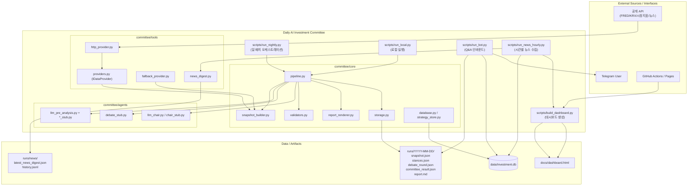
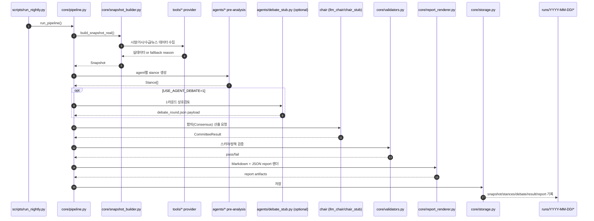

# Daily AI Investment Committee

매일 1회 시장 스냅샷을 만들고, 여러 에이전트 의견을 합쳐 최종 코멘트를 생성하는 배치 프로젝트입니다.

핵심 산출물:
- `runs/YYYY-MM-DD/` (스냅샷, 에이전트 의견, 최종 결과, 리포트)
- `runs/YYYY-MM-DD.json` (통합 JSON)
- `data/investment.db` (누적 지표/이력)
- `docs/dashboard.html` (대시보드)

## 빠른 시작

### 1) 설치
```bash
python -m pip install --upgrade pip
pip install -r requirements.txt
```

### 2) 환경 변수
프로젝트 루트의 `.env`를 사용합니다. 최소 권장:

```env
# OpenAI (LLM 사용 시)
OPENAI_API_KEY=...

# Telegram (전송/봇 사용 시)
TELEGRAM_BOT_TOKEN=...
TELEGRAM_CHAT_ID=...

# FRED (매크로 보강 시)
FRED_API_KEY=...

# 한국은행 ECOS (국내 기준금리 수집 시)
ECOS_API_KEY=...
# 선택: 수출 YoY(901Y011) 항목 코드를 직접 지정할 때
# ECOS_EXPORT_ITEM_CODE=...
```

참고:
- `scripts/run_local.py`, `scripts/run_nightly.py`, `scripts/run_bot.py`는 `.env`를 자동 로드합니다.
- `scripts/send_morning.py`, `scripts/run_news_hourly.py`는 `.env` 자동 로드가 없습니다(실행 환경에 변수 필요).

## 가장 중요한 실행 커맨드

### 일일 배치 (권장)
```bash
python scripts/run_nightly.py
```

옵션:
- `--build-dashboard` : 실행 후 `docs/dashboard.html` 재생성
- `--no-auto-commit` : 자동 커밋 비활성화 (기본은 자동 커밋/푸시 켬)
- `--no-auto-push` : 자동 푸시 비활성화

### 로컬 디버그 실행
```bash
python scripts/run_local.py
```
- 결과: `reports/YYYY-MM-DD.json`
- `run_nightly`와 달리 `runs/YYYY-MM-DD/` 아카이브 저장 경로가 다릅니다.

### 뉴스 시간배치
```bash
python scripts/run_news_hourly.py
```
- 결과: `runs/news/latest_news_digest.json`, `runs/news/history.jsonl`

### 대시보드만 재생성
```bash
python scripts/build_dashboard.py
```

### 아침 브리프 전송
```bash
python scripts/send_morning.py
```

### 주식/재무 데이터 업데이트 커맨드
```bash
# 1) 종목 마스터 동기화 (ticker_master)
python scripts/sync_stock_master.py

# 2) 일자별 주가 동기화 (daily_price_kr)
python scripts/sync_daily_prices.py 2026-04-17

# 3) DART 재무 데이터 동기화 (dart_company_code / financial_statement / financial_metric)
python scripts/sync_financials.py 2025
```

## 파이프라인 흐름

`scripts/run_nightly.py` 기준:
1. Snapshot 생성 (`committee/core/snapshot_builder.py`)
2. 에이전트 사전 분석 (`committee/core/pipeline.py`)
3. 선택적 토론 1라운드 (`USE_AGENT_DEBATE=1`)
4. Chair 최종 합의
5. 리포트 렌더링/저장

저장 위치:
- `runs/YYYY-MM-DD/snapshot.json`
- `runs/YYYY-MM-DD/stances.json`
- `runs/YYYY-MM-DD/debate_round.json` (옵션)
- `runs/YYYY-MM-DD/committee_result.json`
- `runs/YYYY-MM-DD/report.md`
- `runs/YYYY-MM-DD.json`

## 주요 폴더

```text
committee/
  core/        # 파이프라인, 저장, DB, 렌더링
  agents/      # Stub/LLM 에이전트 + Chair
  tools/       # 시장/매크로/뉴스 수집
  schemas/     # Pydantic 스키마
  adapters/    # Telegram 연동

scripts/       # 실행 스크립트
runs/          # 배치 결과 아카이브
reports/       # run_local 결과
data/          # SQLite DB
docs/          # 대시보드 HTML
```

## 자주 쓰는 환경 변수

- `USE_LLM_AGENTS=1` : 에이전트 LLM 사용
- `USE_LLM_CHAIR=1` : Chair LLM 사용
- `USE_AGENT_DEBATE=1` : 토론 라운드 활성화
- `AGENT_MODEL_BACKEND` : 모델 백엔드 선택
- `LLM_TEMPERATURE` / `CHAIR_LLM_TEMPERATURE`
- `RUNS_BASE_DIR` : 과거 runs 기준 경로

## 운영 메모

- DB는 `data/investment.db`를 사용합니다.
- 대시보드는 DB + `runs/*.json`을 읽어 `docs/dashboard.html`로 생성됩니다.
- GitHub Actions 워크플로우(`.github/workflows/deploy-dashboard.yml`)는 `main` 푸시 시 대시보드를 Pages로 배포합니다.

## 버전/의존성 참고

- `requirements.txt` 기준으로 설치하세요.
- `pykrx`는 Python 3.13+에서 설치 제약이 있어, 필요한 경우 Python 3.12 환경을 권장합니다.


---

## 시스템 뷰 (상세 아키텍처 다이어그램)

아래 다이어그램은 **실행 경로(배치/봇/뉴스/대시보드)**와 **데이터 저장 경로(DB, runs, docs)**를 한눈에 보도록 정리한 구조도입니다.

### 1) 전체 시스템 컨텍스트 뷰



### 2) 일일 배치 파이프라인 내부 시퀀스



### 3) 모듈 책임 매트릭스 (System View)

| 레이어 | 주요 파일/폴더 | 책임(Responsibility) | 주요 입출력 |
|---|---|---|---|
| Entry Points | `scripts/run_local.py`, `scripts/run_nightly.py`, `scripts/run_bot.py`, `scripts/run_news_hourly.py`, `scripts/build_dashboard.py` | 실행 모드별 오케스트레이션 | CLI args/env → core 호출 |
| Domain Schemas | `committee/schemas/*.py` | Snapshot/Stance/CommitteeResult 구조 정의 | Python dict/object ↔ Pydantic 모델 |
| Orchestration | `committee/core/pipeline.py` | Snapshot→Stance→(Debate)→CommitteeResult→Report 전체 흐름 제어 | Snapshot, Stance[], CommitteeResult |
| Data Collection | `committee/tools/*.py` | 시장지표/뉴스/거시 데이터 수집 + fallback 전략 | 외부 API 응답 → 정규화된 수치/요약 |
| Agent Logic | `committee/agents/*.py` | 에이전트별 판단 및 Chair 합의 | Snapshot → Stance/CommitteeResult |
| Validation | `committee/core/validators.py` | 금지 문구/길이/티커/스키마 검증 | 생성 산출물 → 검증 결과 |
| Rendering | `committee/core/report_renderer.py` | 사용자용 Markdown/JSON 보고서 생성 | Snapshot+Result → report.md/json |
| Persistence | `committee/core/storage.py`, `committee/core/database.py`, `committee/core/strategy_store.py` | 파일 아카이브/SQLite 전략 이력 저장 | runs/*, `data/investment.db` |
| External Adapter | `committee/adapters/telegram_*.py` | Telegram 전송/응답 처리 | 텔레그램 메시지 ↔ 내부 보고서/DB |
| Presentation | `docs/dashboard.html` (+ `scripts/build_dashboard.py`) | 누적 데이터 시각화 및 Pages 배포 | DB+runs 뉴스 digest → HTML |

---
