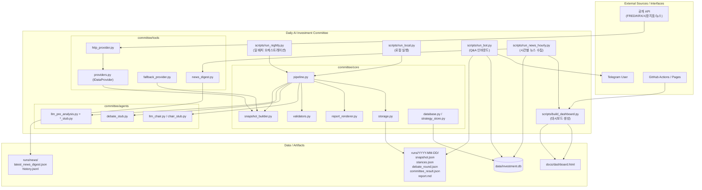
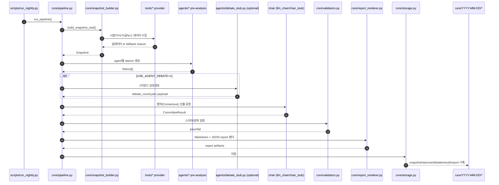

<<<<<<< ours
<<<<<<< ours
<<<<<<< ours
# Daily AI Investment Committee

매일 1회 시장 스냅샷을 만들고, 여러 에이전트 의견을 합쳐 최종 코멘트를 생성하는 배치 프로젝트입니다.

핵심 산출물:
- `runs/YYYY-MM-DD/` (스냅샷, 에이전트 의견, 최종 결과, 리포트)
- `runs/YYYY-MM-DD.json` (통합 JSON)
- `data/investment.db` (누적 지표/이력)
- `docs/dashboard.html` (대시보드)

## 빠른 시작

### 1) 설치
```bash
python -m pip install --upgrade pip
pip install -r requirements.txt
```

### 2) 환경 변수
프로젝트 루트의 `.env`를 사용합니다. 최소 권장:

```env
# OpenAI (LLM 사용 시)
OPENAI_API_KEY=...

# Telegram (전송/봇 사용 시)
TELEGRAM_BOT_TOKEN=...
TELEGRAM_CHAT_ID=...

# FRED (매크로 심화 지표: CPI/PMI/GDP/금리/OAS)
FRED_API_KEY=...

# 한국은행 ECOS (국내 기준금리 수집 시)
ECOS_API_KEY=...
# 선택: 수출 YoY(901Y011) 항목 코드를 직접 지정할 때
# ECOS_EXPORT_ITEM_CODE=...

# DART OpenAPI (한국 주식 재무제표, https://opendart.fss.or.kr 발급)
DART_API_KEY=...
```

API 키 발급 링크:
- FRED: https://fred.stlouisfed.org/docs/api/api_key.html
- 한국은행 ECOS: https://ecos.bok.or.kr/api
- DART: https://opendart.fss.or.kr (회원가입 → API 신청, 무료)

참고:
- `scripts/run_local.py`, `scripts/run_nightly.py`, `scripts/run_bot.py`는 `.env`를 자동 로드합니다.
- `scripts/send_morning.py`, `scripts/run_news_hourly.py`는 `.env` 자동 로드가 없습니다(실행 환경에 변수 필요).

## 커맨드 전체 정리

---

### 🔄 일일 파이프라인

| 목적 | 커맨드 |
|---|---|
| 일일 배치 실행 (AI 분석 + 보고서) | `python scripts/run_nightly.py` |
| 로컬 디버그 실행 | `python scripts/run_local.py` |
| 아침 브리프 전송 (Telegram) | `python scripts/send_morning.py` |
| 시간별 뉴스 수집 | `python scripts/run_news_hourly.py` |
| 대시보드 재생성 | `python scripts/build_dashboard.py` |
| Telegram Q&A 봇 시작 | `python scripts/run_bot.py` |

`run_nightly.py` 주요 옵션:
- `--build-dashboard` : 실행 후 대시보드 재생성
- `--no-auto-commit` / `--no-auto-push` : git 자동 푸시 비활성화

---

### 📦 매일 실행 (`sync_all.py`) — 약 5~15분

시장 지수 · 매크로 · 수급 · 워치리스트 컨센서스 · US 재무제표 · 대시보드 빌드

```bash
# 기본 (매일 권장)
python scripts/sync_all.py

# 빠른 모드 (시장/매크로/수급만, ~5분)
python scripts/sync_all.py --fast

# KR 재무제표 포함 (DART_API_KEY 필요)
python scripts/sync_all.py --with-kr-financials --year 2024

# KR 분기보고서까지
python scripts/sync_all.py --with-kr-financials --year 2024 --quarterly

# FRED 매크로 전체 재백필 (최초 1회)
python scripts/sync_all.py --backfill-macro-all
```

---

### 🗓️ 주간 실행 (`sync_weekly.py`) — 약 2~4시간

종목 마스터 갱신 · 전체 종목 컨센서스 · US 재무제표 · 산업 사이클/가상 포트폴리오 · 미래 경제 연구소 · 주간 LLM 해설 · 대시보드 빌드
매주 1~2회 실행 권장 (종목 데이터가 빠르게 바뀌지 않으므로 매일 불필요)

주간 LLM은 같은 기준일의 산업 사이클 신호가 있는 산업만 분석합니다.
모델 사전학습 지식은 시점 비의존 산업 구조 설명에만 사용하며, 현재 투자
관점은 저장된 정량 신호와 최근 뉴스에만 근거합니다.

미래 경제 연구소는 같은 주간 배치에서 논문, 산업 뉴스의 정책·기업 사건,
산업 사이클 시장 확인, 검증된 과거 사례를 합칩니다. 이 추가 연결 자체는
LLM을 호출하지 않습니다. 정책은 당일 뉴스 보강과 Federal Register 정부·규제 원문을,
기업 행동은 설정된 `DART_API_KEY`가 있을 때 주요사항·거래소 공시 원문을 함께 확인합니다.

```bash
# 기본 (KR 전체 종목 컨센서스 + 마스터 갱신, 주 1회 권장)
python scripts/sync_weekly.py

# 빠른 모드: 상위 300종목만 (~30분)
python scripts/sync_weekly.py --top 300

# 중단 후 재시작
python scripts/sync_weekly.py --resume

# KR 재무제표 생략 (기본: DART_API_KEY 있으면 자동 수집)
python scripts/sync_weekly.py --skip-kr-financials

# 종목 마스터만 갱신 (빠름)
python scripts/sync_weekly.py --master-only

# FRED 매크로 전체 재백필 포함
python scripts/sync_weekly.py --deep-macro

# 종목 데이터 생략하고 마스터 + 매크로만
python scripts/sync_weekly.py --skip-stocks

# 미래 경제 연구소 상태 갱신만 일시적으로 생략
python scripts/sync_weekly.py --skip-future-economy
```

| 플래그 | 설명 |
|---|---|
| `--top N` | 상위 N종목만 컨센서스 수집 |
| `--resume` | 오늘 수집된 종목 건너뜀 (재시작용) |
| `--skip-kr-financials` | KR 재무제표 건너뜀 (기본: DART_API_KEY 있으면 자동 수집) |
| `--skip-us-financials` | US 재무제표 건너뜀 |
| `--master-only` | 종목 마스터 갱신만 |
| `--deep-macro` | FRED 전체 재백필 |
| `--skip-stocks` | 컨센서스·재무 생략 |
| `--skip-future-economy` | 미래 경제 연구소 주간 상태·위원회 안건 갱신 생략 |

---

### 📊 시장 데이터 수집 (market_daily / daily_macro / market_flow_daily)

```bash
# 시장 지수 (Kospi/Nasdaq/S&P 등) 기간 백필
python scripts/backfill_market_daily_history.py --start-date 2024-01-01 --end-date 2026-04-26

# 매크로 지표 기본 (US10Y/VIX/DXY/원달러/WTI) 백필
python scripts/backfill_daily_macro_history.py --start-date 2024-01-01 --end-date 2026-04-26

# 매크로 심화 지표 (FRED: CPI/PMI/GDP/금리/OAS) 백필
python scripts/backfill_macro_indicators.py

# 수급 (외국인/기관/개인) 백필
python scripts/backfill_market_flow_history.py --start-date 2024-01-01 --end-date 2026-04-26

# 위 전체를 날짜 범위 지정으로 한번에
python scripts/backfill_all_history.py --start-date 2024-01-01 --end-date 2026-04-26
```

---

### 🏦 종목 마스터 / 주가

```bash
# KRX 전체 상장 종목 마스터 동기화 (~2,500종목)
python scripts/sync_stock_master.py

# 특정 날짜 전체 종목 일별 주가 수집
python scripts/sync_daily_prices.py 2026-04-25
```

---

### 📈 애널리스트 컨센서스 (목표주가 / 투자의견 / EPS 추정)

```bash
# 워치리스트 수집 (KR 12 + US 10 = 22종목, 빠름)
python scripts/sync_stock_consensus.py

# 특정 종목만
python scripts/sync_stock_consensus.py --tickers AAPL 005930 NVDA

# DB에 저장된 종목 갱신
python scripts/sync_stock_consensus.py --from-db

# 저장 없이 조회만
python scripts/sync_stock_consensus.py --dry-run --tickers AAPL

# 특정 종목 히스토리 보기
python scripts/sync_stock_consensus.py --show 005930

# ★ ticker_master 전체 종목 수집 (약 1~3시간, KRX 전체 ~2,500종목)
python scripts/sync_all_stocks.py

# 상위 300종목만
python scripts/sync_all_stocks.py --top 300

# 중단 후 재시작 (오늘 수집된 종목 건너뜀)
python scripts/sync_all_stocks.py --resume

# 특정 종목만 테스트
python scripts/sync_all_stocks.py --tickers 005930 000660 035420
```

---

### 📑 재무제표 (매출 / 영업이익 / ROE / EPS / FCF 등)

```bash
# 미국 주식 재무제표 (yfinance, API 키 불필요)
python scripts/sync_financials.py --us

# 미국 특정 종목
python scripts/sync_financials.py --us --us-tickers AAPL NVDA TSLA MSFT

# 한국 주식 연간 재무제표 (DART_API_KEY 필요)
python scripts/sync_financials.py --year 2024

# 한국 분기 포함
python scripts/sync_financials.py --year 2024 --quarterly

# 특정 KR 종목만
python scripts/sync_financials.py --year 2024 --kr-tickers 005930 000660

# KR + US 동시
python scripts/sync_financials.py --year 2024 --quarterly --us

# 종목 재무성과 터미널 조회
python scripts/sync_financials.py --show AAPL
python scripts/sync_financials.py --show 005930

# ★ 전체 종목 재무제표 포함 (오래 걸림)
python scripts/sync_all_stocks.py --with-kr-financials --year 2024 --quarterly
```

---

### 🔧 runs 복구 / 백필

```bash
# 누락된 날짜 runs 파이프라인 재실행 (AI 제외)
python scripts/backfill_pipeline_range.py --start-date 2025-01-01 --end-date 2025-12-31 --exclude-ai

# DB 기반으로 runs/*.json 재생성
python scripts/rebuild_runs_from_db.py --start-date 2025-01-01 --end-date 2025-12-31
```

---

### 🗂️ DB 유지보수

```bash
# 0.0 플레이스홀더를 NULL로 마이그레이션
python scripts/migrate_db_nulls.py
```

## 파이프라인 흐름

`scripts/run_nightly.py` 기준:
1. Snapshot 생성 (`committee/core/snapshot_builder.py`)
2. 에이전트 사전 분석 (`committee/core/pipeline.py`)
3. 선택적 토론 1라운드 (`USE_AGENT_DEBATE=1`)
4. Chair 최종 합의
5. 리포트 렌더링/저장

저장 위치:
- `runs/YYYY-MM-DD/snapshot.json`
- `runs/YYYY-MM-DD/stances.json`
- `runs/YYYY-MM-DD/debate_round.json` (옵션)
- `runs/YYYY-MM-DD/committee_result.json`
- `runs/YYYY-MM-DD/report.md`
- `runs/YYYY-MM-DD.json`

## 주요 폴더

```text
committee/
  core/        # 파이프라인, 저장, DB, 렌더링
  agents/      # Stub/LLM 에이전트 + Chair
  tools/       # 시장/매크로/뉴스 수집
  schemas/     # Pydantic 스키마
  adapters/    # Telegram 연동

scripts/       # 실행 스크립트
runs/          # 배치 결과 아카이브
reports/       # run_local 결과
data/          # SQLite DB
docs/          # 대시보드 HTML
```

## 자주 쓰는 환경 변수

- `USE_LLM_AGENTS=1` : 에이전트 LLM 사용
- `USE_LLM_CHAIR=1` : Chair LLM 사용
- `CHAIR_OPENAI_MODEL=gpt-5.6-terra` : 평상시 의장 모델
- `CHAIR_REASONING_EFFORT=medium` : 평상시 의장 추론 강도
- `CHAIR_ESCALATION_MODEL=gpt-5.6-sol` : 충돌·급변·월간 보고서 시 승격 모델
- `CHAIR_FORCE_SOL=1` / `CHAIR_URGENT_FLAG=1` : 수동·긴급 승격 스위치
- `CHAIR_REPORT_MODE=monthly` : 월간 보고서 실행 시 Sol 승격
- `USE_AGENT_DEBATE=1` : 토론 라운드 활성화
- `AGENT_MODEL_BACKEND` : 모델 백엔드 선택
- `LLM_TEMPERATURE` : 사전분석 에이전트 온도
- `INDUSTRY_LLM_MODEL` : 주간 산업 해설 모델 (기본 `gpt-4.1`)
- `RUNS_BASE_DIR` : 과거 runs 기준 경로

## 운영 메모

- DB는 `data/investment.db`를 사용합니다.
- 대시보드는 DB + `runs/*.json`을 읽어 `docs/dashboard.html`로 생성됩니다.
- GitHub Actions 워크플로우(`.github/workflows/deploy-dashboard.yml`)는 `main` 푸시 시 대시보드를 Pages로 배포합니다.

## 버전/의존성 참고

- `requirements.txt` 기준으로 설치하세요.
- `pykrx`는 Python 3.13+에서 설치 제약이 있어, 필요한 경우 Python 3.12 환경을 권장합니다.


---

## 시스템 뷰 (상세 아키텍처 다이어그램)

아래 다이어그램은 **실행 경로(배치/봇/뉴스/대시보드)**와 **데이터 저장 경로(DB, runs, docs)**를 한눈에 보도록 정리한 구조도입니다.

### 1) 전체 시스템 컨텍스트 뷰


```mermaid
flowchart TB
  subgraph EXT[External Sources / Interfaces]
    APIs["공개 API<br/>(FRED/KRX/시장지표/뉴스)"]
    TG[Telegram User]
    GH[GitHub Actions / Pages]
  end

  subgraph APP[Daily AI Investment Committee]
    NIGHT["scripts/run_nightly.py<br/>(일 배치 오케스트레이션)"]
    LOCAL["scripts/run_local.py<br/>(로컬 실행)"]
    BOT["scripts/run_bot.py<br/>(Q&A 인바운드)"]
    NEWS["scripts/run_news_hourly.py<br/>(시간별 뉴스 수집)"]
    DASH["scripts/build_dashboard.py<br/>(대시보드 생성)"]

    subgraph CORE[committee/core]
      PIPE[pipeline.py]
      SNAP[snapshot_builder.py]
      VAL[validators.py]
      RENDER[report_renderer.py]
      STORE[storage.py]
      DBM[database.py / strategy_store.py]
    end

    subgraph AGENT[committee/agents]
      PRE[llm_pre_analysis.py + *_stub.py]
      CHAIR[llm_chair.py / chair_stub.py]
      DEBATE[debate_stub.py]
    end

    subgraph TOOLS[committee/tools]
      PROVIDERS["providers.py (IDataProvider)"]
      HTTP[http_provider.py]
      FALLBACK[fallback_provider.py]
      NEWSDIGEST[news_digest.py]
    end
  end

  subgraph DATA[Data / Artifacts]
    DB[(data/investment.db)]
    RUNS["runs/YYYY-MM-DD/<br/>snapshot.json<br/>stances.json<br/>debate_round.json<br/>committee_result.json<br/>report.md"]
    NEWSRUNS["runs/news/<br/>latest_news_digest.json<br/>history.jsonl"]
    DOCS[docs/dashboard.html]
  end

  APIs --> HTTP
  HTTP --> PROVIDERS
  PROVIDERS --> SNAP
  FALLBACK --> SNAP
  NEWSDIGEST --> NEWSRUNS

  NIGHT --> PIPE
  LOCAL --> PIPE
  PIPE --> SNAP
  PIPE --> PRE
  PIPE --> DEBATE
  PIPE --> CHAIR
  PIPE --> VAL
  PIPE --> RENDER
  PIPE --> STORE
  STORE --> RUNS
  DBM --> DB

  NEWS --> NEWSDIGEST
  NEWS --> DB
  NEWS --> DASH
  DASH --> DOCS

  BOT --> RUNS
  BOT --> DB
  BOT --> TG

  GH --> DASH
  DASH --> DOCS
```

### 2) 일일 배치 파이프라인 내부 시퀀스


```mermaid
sequenceDiagram
  autonumber
  participant S as scripts/run_nightly.py
  participant P as core/pipeline.py
  participant B as core/snapshot_builder.py
  participant T as tools/* provider
  participant A as agents/* pre-analysis
  participant D as agents/debate_stub.py (optional)
  participant C as chair (llm_chair/chair_stub)
  participant V as core/validators.py
  participant R as core/report_renderer.py
  participant ST as core/storage.py
  participant FS as runs/YYYY-MM-DD/*

  S->>P: run_pipeline()
  P->>B: build_snapshot_real()
  B->>T: 시장/거시/수급/뉴스 데이터 수집
  T-->>B: 실데이터 or fallback reason
  B-->>P: Snapshot
  P->>A: agent별 stance 생성
  A-->>P: Stance[]
  opt USE_AGENT_DEBATE=1
    P->>D: 1라운드 상호검토
    D-->>P: debate_round.json payload
  end
  P->>C: 합의(Consensus) 산출 요청
  C-->>P: CommitteeResult
  P->>V: 스키마/정책 검증
  V-->>P: pass/fail
  P->>R: Markdown + JSON report 렌더
  R-->>P: report artifacts
  P->>ST: 저장
  ST-->>FS: snapshot/stances/debate/result/report 기록
```

### 3) 모듈 책임 매트릭스 (System View)

| 레이어 | 주요 파일/폴더 | 책임(Responsibility) | 주요 입출력 |
|---|---|---|---|
| Entry Points | `scripts/run_local.py`, `scripts/run_nightly.py`, `scripts/run_bot.py`, `scripts/run_news_hourly.py`, `scripts/build_dashboard.py` | 실행 모드별 오케스트레이션 | CLI args/env → core 호출 |
| Domain Schemas | `committee/schemas/*.py` | Snapshot/Stance/CommitteeResult 구조 정의 | Python dict/object ↔ Pydantic 모델 |
| Orchestration | `committee/core/pipeline.py` | Snapshot→Stance→(Debate)→CommitteeResult→Report 전체 흐름 제어 | Snapshot, Stance[], CommitteeResult |
| Data Collection | `committee/tools/*.py` | 시장지표/뉴스/거시 데이터 수집 + fallback 전략 | 외부 API 응답 → 정규화된 수치/요약 |
| Agent Logic | `committee/agents/*.py` | 에이전트별 판단 및 Chair 합의 | Snapshot → Stance/CommitteeResult |
| Validation | `committee/core/validators.py` | 금지 문구/길이/티커/스키마 검증 | 생성 산출물 → 검증 결과 |
| Rendering | `committee/core/report_renderer.py` | 사용자용 Markdown/JSON 보고서 생성 | Snapshot+Result → report.md/json |
| Persistence | `committee/core/storage.py`, `committee/core/database.py`, `committee/core/strategy_store.py` | 파일 아카이브/SQLite 전략 이력 저장 | runs/*, `data/investment.db` |
| External Adapter | `committee/adapters/telegram_*.py` | Telegram 전송/응답 처리 | 텔레그램 메시지 ↔ 내부 보고서/DB |
| Presentation | `docs/dashboard.html` (+ `scripts/build_dashboard.py`) | 누적 데이터 시각화 및 Pages 배포 | DB+runs 뉴스 digest → HTML |

---
=======
=======
>>>>>>> theirs
=======
>>>>>>> theirs
# 마음톡 💛

중등부 학생이 여름 아웃리치 전에 시골 어르신께 먼저 인사하고, 질문하고, 공감하는 경험을 게임처럼 연습하는 모바일 우선 한국어 음성 대화 MVP입니다. 회원가입·서버 DB·음성 저장 없이 동작하며 진행 기록은 브라우저 `localStorage`에만 저장합니다.

## 주요 기능

- 데이터 기반 어르신 3명과 미션 5개
- 브라우저 Web Speech API STT와 `speechSynthesis` TTS (지원하지 않는 브라우저에서는 안내 표시)
- 인사·질문·리액션·공감·침묵 깨기의 결정론적 점수 및 배지
- Zod로 검증하는 AI structured JSON 응답
- API 키 없이 전체 흐름을 체험하는 Mock Mode
- GitHub Pages 프론트엔드 + 선택적인 Vercel Serverless API 분리

## 로컬 실행

Node.js 20 이상을 준비합니다.

```bash
npm install
cp .env.example .env
npm run dev
```

`.env` 기본값인 `VITE_MOCK_MODE=true`에서는 OpenAI 키 없이 실행됩니다. 음성 인식은 Chrome/Edge 계열 브라우저와 HTTPS(또는 localhost)를 권장하며 마이크 권한을 허용해야 합니다.

## 실제 OpenAI 연결

브라우저 번들에 API 키를 넣으면 안 됩니다. `api/chat.ts`를 Vercel에 배포하고 Vercel 프로젝트의 **서버 환경 변수**에 다음을 등록합니다.

```dotenv
OPENAI_API_KEY=sk-...
OPENAI_MODEL=gpt-4o-mini
```

그 뒤 프론트엔드 환경 변수를 아래처럼 바꿉니다.

```dotenv
VITE_MOCK_MODE=false
VITE_API_URL=https://YOUR-VERCEL-PROJECT.vercel.app/api/chat
```

`gpt-4` 계열도 사용할 수 있지만 이 앱은 짧은 역할극과 구조화 평가가 중심이므로, 비용·응답 속도가 좋은 소형 모델부터 시작하고 실제 학생 대화 샘플로 품질을 비교하는 편이 좋습니다. 모델 ID는 계정에서 현재 지원되는 structured outputs 호환 모델로 설정하세요. API 코드는 JSON Schema 응답을 요구합니다.

Vercel CLI를 쓸 경우 `npm i -g vercel`, `vercel`로 연결한 뒤 환경 변수를 등록하고 `vercel --prod`로 배포할 수 있습니다.

## GitHub Pages / Actions

1. 저장소 **Settings → Pages → Source**를 **GitHub Actions**로 선택합니다.
2. Actions 변수에 `VITE_MOCK_MODE`를 등록합니다. Mock 데모는 `true`입니다.
3. 실제 AI 모드라면 `VITE_API_URL`에 Vercel 함수 URL도 등록합니다. OpenAI 키는 GitHub Pages에 등록하지 않습니다.
4. `main` 또는 `work` 브랜치 push 시 lint, build 후 Pages 배포가 실행됩니다.

저장소 이름이 `outreachgogo`가 아니라면 `vite.config.ts`의 GitHub Actions용 `base` 경로도 저장소 이름에 맞게 수정합니다. GitHub Pages는 정적 호스팅이므로 OpenAI 호출은 Vercel 함수가 담당합니다.

## 명령어

```bash
npm run dev       # 개발 서버
npm run lint      # ESLint
npm run build     # TypeScript 검사 + 프로덕션 빌드
npm run preview   # 빌드 결과 확인
```

## 구조

```text
src/
  hooks/          localStorage 진행 기록
  missions/       미션 데이터
  personas/       캐릭터 설정과 프롬프트
  scoring/        결정론적 평가와 점수
  services/
    llm/          Mock/실제 API 어댑터와 Zod 검증
    speech/       교체 가능한 STT/TTS 인터페이스
  types/          공용 타입
api/chat.ts       API 키를 보호하는 Vercel Function
.github/workflows/deploy.yml  Pages 빌드/배포
```

## 개인정보와 운영 참고

음성은 브라우저 음성 인식 기능으로 텍스트화되며 앱 서버에 원본을 저장하지 않습니다. 실제 AI 모드에서는 대화 텍스트가 모델 API로 전송됩니다. 학생에게 이 사실을 안내하고 이름·연락처 등 개인정보를 말하지 않도록 운영 규칙을 마련하세요. 프로덕션에서는 Vercel API의 허용 Origin을 실제 Pages 도메인으로 제한하고 rate limit도 추가하는 것을 권장합니다.
<<<<<<< ours
<<<<<<< ours
>>>>>>> theirs
=======
>>>>>>> theirs
=======
>>>>>>> theirs
