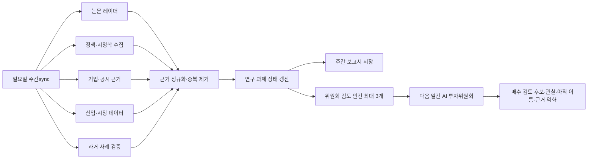

# 미래 경제 연구소 설계

## 1. 목적

미래 경제 연구소는 전 세계의 정책·기술·논문·기업·시장 변화를 근거로 3~12개월 뒤 성장 가능성이 있는 산업을 연구하고, 그 변화가 한국 산업과 국내 상장기업에 전달되는 경로를 추적한다.

이 기능은 자동매매나 주문 실행 기능이 아니다. 미래 연구소는 장기 가설과 근거의 성숙도를 관리하고, AI 투자위원회는 최신 거시경제·가격·수급을 별도로 확인해 현재 검토할 가치가 있는지를 판단한다.

## 2. 제품 경계

### 미래 경제 연구소가 하는 일

- 전 세계 변화에서 한국 산업으로 이어지는 전달 경로를 설명한다.
- 출처가 확인된 근거만 저장하고 점수에 반영한다.
- 연구 과제를 3~12개월 동안 누적 추적한다.
- 과거 유사 사례의 공통점, 차이점, 재현 조건을 비교한다.
- 근거가 충분한 연구 과제만 AI 투자위원회의 검토 안건으로 전달한다.

### 미래 경제 연구소가 하지 않는 일

- 주문 실행 또는 자동매매
- 근거가 없는 종목 추천
- LLM의 사전학습 기억만으로 과거 사례 확정
- 논문 한 편이나 정치 뉴스 한 건만으로 투자 결론 생성
- 매주 정해진 수의 가설을 억지로 생성

## 3. 기존 기능의 재사용과 정리

| 기존 기능 | 결정 | 이유 |
|---|---|---|
| `research_radar` 모델·점수 엔진 | 유지·확장 | URL·날짜·시점 오염 방지·반증·기업 연결 계약이 이미 구현됨 |
| arXiv 주간 수집·GPT 초록 해석 | 미래 연구소의 논문 근거 축으로 이동 | 매주 일요일 배치에 이미 연결됨 |
| `🔬 연구→시장` 독립 탭 | 제거 | 미래 연구소 내부의 `논문·기술 신호`와 기능 중복 |
| 탐욕의 항아리의 2·3차 수혜 가설 | 개념만 유지 | 미래 전달 경로와 숨은 수혜 산업 탐색에 유용 |
| 악마·항아리·욕망 문체 | 제거 | 장기 연구 과제와 출처 중심 제품에 맞지 않음 |
| 매일 `GreedPotAgent` 호출 | 주간 연구 파이프라인으로 대체 | 일간 이야기 생성보다 누적 연구가 목적에 맞고 비용·노이즈가 낮음 |
| `greed_pot.json` | 읽기 호환 후 폐기 | 기존 실행 산출물이 있는 기간의 화면 깨짐 방지 |

## 4. 연구영역

기본 영역 8개는 자료 수집의 안테나이며 투자 결론을 미리 정하지 않는다.

1. AI·반도체·데이터센터
2. 로봇·자동화·자율주행
3. 전력망·원전·신재생에너지
4. 배터리·전기차·차세대 이동수단
5. 바이오·의료·고령화 기술
6. 국방·우주·사이버보안
7. 기후·물·식량·환경 인프라
8. 첨단소재·공급망 재편

키워드 밖의 변화를 포착하는 자유 탐색 영역을 2개 둔다. 자유 탐색 주제가 여러 주에 걸쳐 반복되고 근거 기준을 통과하면 기본 영역 또는 정식 연구 과제로 승격한다.

## 5. 근거 계약

정식 점수에 포함되는 모든 근거는 다음 필드를 갖는다.

| 필드 | 의미 |
|---|---|
| `evidence_id` | 중복되지 않는 근거 식별자 |
| `evidence_type` | `policy`, `research`, `corporate`, `market`, `historical_analogy` |
| `title`, `claim` | 출처 제목과 출처가 직접 지지하는 주장 |
| `event_date` | 실제 사건·발표일 |
| `known_at` | 시스템이 해당 사실을 알 수 있게 된 날짜 |
| `source_url`, `source_name` | 사용자가 직접 확인할 수 있는 링크와 출처명 |
| `source_kind` | 공식자료·논문·공시·기업발표·언론·2차 분석 등 품질 분류 |
| `direction` | 가설을 `positive`, `neutral`, `negative` 중 어느 방향으로 움직이는지 |
| `strength` | 출처가 직접 뒷받침하는 강도(0~1) |
| `limitation` | 해당 근거로는 확인할 수 없는 부분 |

운영 규칙은 다음과 같다.

- `known_at <= as_of`인 근거만 사용한다.
- 출처 링크가 없으면 정식 점수에 포함하지 않는다.
- 정책은 정부·의회·규제기관 원문을 우선한다.
- 논문은 제목·연구기관·발표일·원문 링크를 보존한다.
- 기업 근거는 공시·실적 발표·공식 투자계획을 우선한다.
- 언론 기사는 탐색 신호 또는 낮은 가중치의 보조 근거로 사용한다.
- LLM 사전학습 지식은 검색 후보를 제안할 수 있지만 근거 점수를 만들 수 없다.
- 긍정 근거만 있는 연구 과제에는 낙관 편향 경고를 표시한다.

## 6. 연구 과제 모델

각 과제는 아래 정보를 누적 관리한다.

```text
research_id
domain_id
title
thesis
horizon_months          # 3~12
status                  # initial_watch | active | committee_review | weakened | archived
weekly_change           # new | strengthened | maintained | weakened | archived
evidence_type_count
evidence_ids
transmission_chain      # 세계 변화 → 산업 → 한국 영향 → 관찰 기업
historical_analogues
watch_industries
watch_companies
invalidation_conditions
first_seen_at
last_updated_at
last_committee_handoff_at
```

활성 과제는 최대 10개, 신규 등록은 주당 최대 3개다. 근거가 부족한 주에는 신규 과제가 0개여도 정상이다.

## 7. 상태 판정

### 등록과 승격

| 판정 | 조건 |
|---|---|
| `초기 관찰` | 유효한 근거 유형 0~1개 |
| `정식 연구` | 서로 독립적인 근거 유형 2개 이상 |
| `위원회 검토` | 근거 유형 3개 이상이며 반증 조건이 발생하지 않음 |
| `근거 약화` | 핵심 부정 근거 발생, 근거 만료 또는 전달 경로 단절 |
| `연구 종료` | 명시한 폐기 조건 발생 또는 장기간 추가 근거 없음 |

근거 유형 수는 같은 기사를 여러 매체가 반복 보도한 횟수가 아니라 `policy`, `research`, `corporate`, `market`, `historical_analogy`의 독립 범주 수다.

### 매수 검토 후보의 역할 분리

미래 연구소는 장기 성장 가능성만 판정한다. `매수 검토 후보` 승격은 AI 투자위원회만 수행한다.

위원회는 다음을 다시 확인한다.

1. 미래 가설과 근거의 강도
2. 산업 매출·비용·투자로 전달되는 경제적 경로
3. 기업의 실제 수혜 노출도와 공시 근거
4. 현재 금리·환율·유동성·정책 환경
5. 실적·가격·수급의 초기 확인
6. 가치평가·과열·가설 폐기 위험

미래 연구소 안건에는 주문이나 비중 변경 명령을 포함하지 않는다. 위원회 화면의 판정 문구는 `매수 검토 후보`, `관찰`, `아직 이름`, `근거 약화`로 제한한다.

## 8. 과거 사례 사용 규칙

과거 사례는 LLM 기억만으로 확정하지 않는다.

1. LLM이 유사 사례 후보를 제안한다.
2. 공식자료·원문·신뢰 가능한 기사로 날짜와 사건을 확인한다.
3. 확인된 사례만 `historical_analogy` 근거로 저장한다.
4. 현재 가설과 `유사한 점`, `다른 점`, `이번에도 적용될 조건`을 각각 기록한다.
5. 가격 반응을 언급하려면 당시 시점 데이터와 관찰 기간을 함께 기록한다.

## 9. 주간·일간 실행 흐름

현재 Windows 예약 작업 `주간sync`는 매주 일요일 12:31에 `scripts/sync_weekly.py`를 실행한다. 새 예약 작업을 만들지 않고 여기에 통합한다.



권장 주간 단계 순서는 다음과 같다.

1. 기존 산업·종목·매크로 주간 동기화
2. 8개 기본 영역과 자유 탐색의 논문 수집
3. 정책·지정학·기업 근거 수집
4. 과거 사례 후보 검증
5. 이전 주 연구 상태 로드
6. 근거 병합·중복 제거·시점 검증
7. 신규 과제 등록과 기존 과제 상태 갱신
8. 위원회 검토 안건 생성
9. 대시보드 생성

일간 파이프라인은 최신 주간 보고서에서 다음 조건을 만족한 안건만 읽는다.

- 상태가 `committee_review`
- 근거 유형이 3개 이상
- 최신 보고서가 14일보다 오래되지 않음
- 반증 조건이 발생하지 않음
- 안건은 최대 3개

주간 작업이 실패하면 이전 보고서를 수정하지 않는다. 화면에는 마지막 성공 기준일과 오래됨 경고를 표시하며, 오래된 안건은 신규 승격 근거로 사용하지 않는다.

## 10. 저장 구조

기존 날짜별 산출물 방식을 유지해 재현성과 롤백 가능성을 확보한다.

```text
config/
  future_economy_domains.json          # 8개 기본 영역·키워드·자유 탐색 설정

runs/<as-of>/future_economy/
  weekly_report.json                   # 그 주의 전체 상태 스냅샷
  committee_agenda.json                # 일간 위원회가 읽을 최대 3개 안건
  evidence.json                        # 정규화된 근거와 출처
  audit.json                           # 모델·프롬프트·토큰·입력 해시·실패 기록
  weekly_report.md                     # 사람이 읽는 보고서

runs/<as-of>/research_radar/
  <theme-id>.json                      # 논문 원천 산출물, 계속 보존
```

주간 상태는 가장 최근의 성공한 `weekly_report.json`을 입력으로 읽고 새 날짜 폴더에 새 스냅샷을 쓴다. 과거 파일을 덮어쓰지 않는다.

## 11. AI 투자위원회 전달 계약

`committee_agenda.json`의 각 안건은 다음 정보만 전달한다.

```text
research_id
title
horizon_months
thesis
weekly_change
evidence_type_count
top_evidence[]         # 제목·날짜·URL·방향
transmission_chain
watch_industries
watch_companies[]      # 기업명·연결 이유·공시 근거
historical_comparison
invalidation_conditions
research_score
```

의장 프롬프트에는 이 데이터를 `future_economy_context`로 넣는다. 의장은 제공된 안건 밖의 미래 사실을 보충하거나 종목을 새로 만들 수 없다. 미래 안건과 당일 거시·수급이 충돌하면 충돌 사실을 명시하고 `아직 이름` 또는 `관찰`을 우선한다.

## 12. 화면 통합

상단의 `🏺 탐욕의 항아리` 탭을 `🔭 미래 경제 연구소`로 교체하고 `🔬 연구→시장` 탭은 제거한다.

미래 경제 연구소 화면 순서는 다음과 같다.

1. **이번 주 연구 요약** — 신규·강화·약화·종료 수와 마지막 성공 기준일
2. **AI 투자위원회 검토 안건** — 근거 3종 이상인 과제와 전달 이유
3. **활성 연구 과제** — 최대 10개, 상태·기간·전달 경로·반증 조건
4. **신규 정책·논문·기술 신호** — 출처 링크와 한계 포함
5. **과거 사례 비교** — 유사점·차이점·재현 조건
6. **보관함** — 약화·종료된 과제와 종료 이유

기존 북마크를 위해 `#greed-pot`과 `#research-radar`는 한동안 `#future-economy`로 이동시킨다. 대시보드 데이터 키도 새 `future_economy`를 사용하되, 새 주간 산출물이 없을 때는 기존 `research_radar` 보고서를 논문 섹션에 표시하는 읽기 호환을 둔다.

## 13. 구현 단계

### 1단계 — 탭 통합과 호환 화면

- 미래 경제 연구소 탭과 화면 골격 추가
- 독립 연구→시장 탭 제거
- 기존 연구 레이더 결과를 논문·기술 신호로 이동
- 기존 탐욕의 항아리 데이터가 있으면 `이전 형식 자료`로만 읽기
- 빈 상태, 오래된 상태, 출처 링크 렌더링 테스트

### 2단계 — 연구 과제와 주간 상태 엔진

- `future_economy` 모델·검증·상태 판정 구현
- 8개 기본 영역과 자유 탐색 2개 설정
- 이전 주 스냅샷을 읽는 누적 상태 갱신
- 신규 3개·활성 10개·0개 허용 규칙 구현
- 감사 로그와 결정론적 테스트 추가

### 3단계 — 근거 수집 확대

- 정책·지정학 공식자료 수집기
- 기업 공시·투자·실적 근거 연결
- 산업 사이클과 시장 근거 연결
- 검증 가능한 과거 사례 라이브러리
- 중복 보도와 동일 출처 재인용 제거

### 4단계 — AI 투자위원회 연결

- `committee_agenda.json` 생성
- 일간 의장 입력에 최대 3개 안건 추가
- 현재 거시·가격·수급과의 일치·충돌 판정
- 결과를 미래 연구소와 AI 투자위원회 양쪽 화면에 표시

### 5단계 — 운영 검증

- 일요일 작업 일부 실패 시 이전 성공본 보존
- 14일 이상 오래된 안건 승격 차단
- 출처 없는 근거 점수 제외
- 반증 없는 과제의 낙관 편향 경고
- 모델 호출 비용·토큰·입력 해시 기록

### 현재 구현 상태 · 2026-08-25

- 1·2·4단계의 핵심 흐름 구현 완료
- 3단계 중 저장된 산업 뉴스의 정책·기업 사건 분류, 당일 정책 RSS 보강, 산업 사이클 시장 확인,
  검증형 과거 사례 목록 연결 완료
- 동일 기사 한 건을 정책과 기업 근거로 중복 계산하지 않으며 블로그·동영상·중고거래 출처 제외
- 정책·기업 근거는 각각 90일·60일, 시장 근거는 14일 뒤 만료되어 상태를 다시 계산
- 위원회 상위 근거는 점수순 논문 5개가 아니라 근거 유형별 대표 1개씩 전달
- Federal Register 정부·규제 원문 API를 주간 정책 근거에 연결하고 행정성 의견수렴 공고는 제외
- DART 주요사항·거래소 공시를 직접 산업 매핑이 있는 국내 종목에만 연결
- 공식 원문 수집 실패는 수집기 단위로 격리하고 감사 로그에 원천 건수·오류를 기록
- 다음 확장 후보는 한국 정부 원문 API 추가와 DART 공시 본문 항목 단위 해석

## 14. 완료 기준

- 연구→시장 독립 탭 없이 기존 논문 근거를 미래 연구소에서 볼 수 있다.
- 일요일 배치가 새 근거가 없어도 정상 종료하고 신규 0개를 표시한다.
- 출처 링크 없는 정보가 정식 근거 수나 점수를 올리지 못한다.
- 동일한 입력은 동일한 상태와 점수를 생성한다.
- 활성 과제는 10개, 신규 과제는 주당 3개를 넘지 않는다.
- 근거 유형 3개 미만인 과제는 위원회 안건이 되지 않는다.
- 위원회는 미래 연구소 안건을 참고하되 주문이나 자동매매를 수행하지 않는다.
- 각 과제에서 강화·약화·종료 이유와 사용한 출처를 확인할 수 있다.
